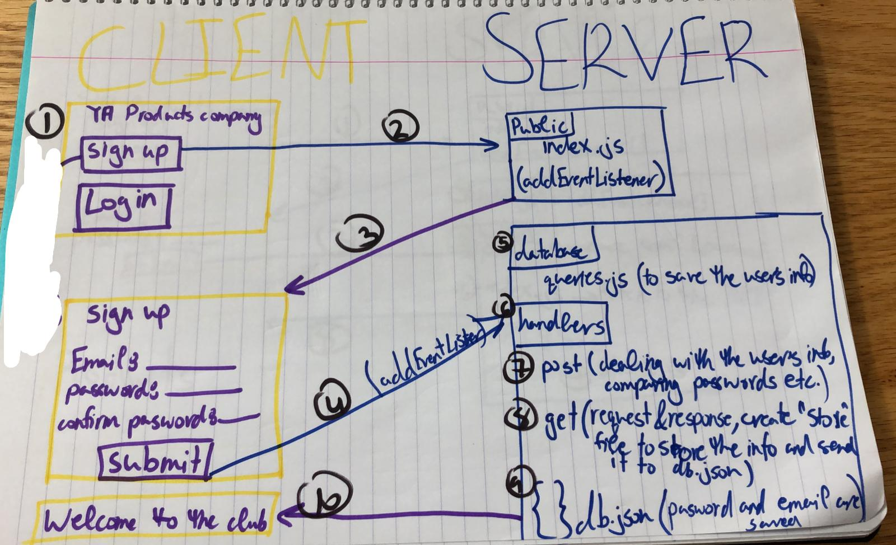
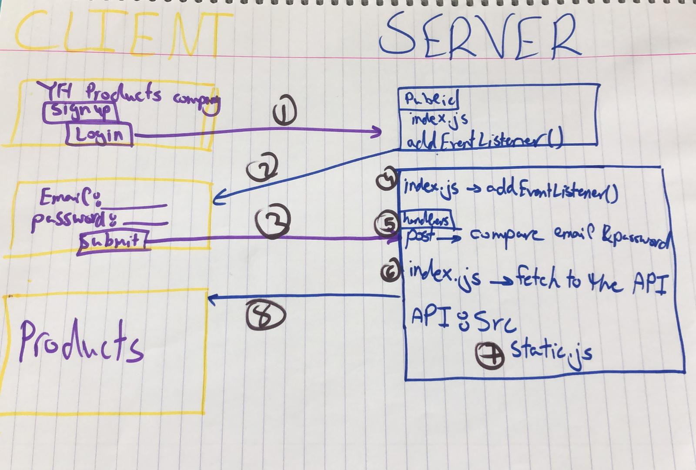

# YH-Products-company
Buying products

Who doesn't get upset when going to a store? Almost none of us! We all
would prefer to stay at home and order some things, and when arriving to a store we just would pay, pack our order and bye-bye, right? That's where we
(@jasmineb2011 :sunglasses: @hodamansour :sunglasses:) come to the picture. We have created a webpage to be used the exact way as we described above.

This webpage has been created with two methods: html and javascript.

the html was used to have a description in the browser, while javascript to make everything so real!

the folder src was created to 'hide' the code from the users, so we can use it safely and no code will be 'stolen'.

In this folder we've got other folders: database, queries and files in the root.

database:
1. db_build.js:
2. db_build.sql: build our database tables- customers, products and customersProducts.
3. db_connection.js:
4. queries.js: save the user's info.

queries:
1. getCustomersData.js: create a store file to store the user's info.
2. postCustomersData.js: compare user's info.

src(the root):
1. dynamic.js:
2. handlers.js:
3. router.js:
4. server.js:
5. static.js: where our api 'hides'.

Oh, no worries, when logging in the cookie will be turned on, and when logging out it'll be turned off, keep calm, your secret is safe with us :smile:

Note: A cookie is a piece of data that your server, hosted on a certain domain (localhost, google.com etc) sends back to the browser, which the browser will then keep, and attach to every future request to that domain. An amazon.com cookie will not be attached to a request to an ebay.com domain, for example.

sign up architecture:

login architecture:

